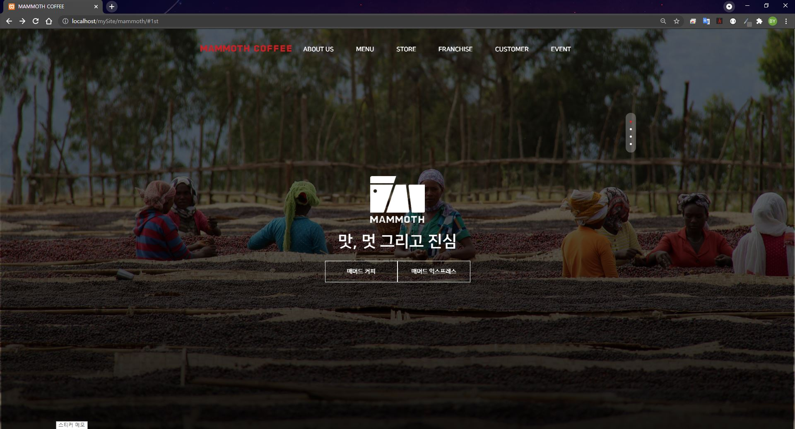

# Mamomth Renewal

## Overview 😎

리뉴얼 프로젝트의 일환으로 Mammoth Coffee 웹사이트를 리뉴얼 제작해 보았습니다.  기존 Mammoth Coffee와 같이 fullpage plugin을 사용하였으며 jquery를 활용하여 간단한 기능들을 추가해보았습니다.  구현된 페이지는 아래 링크를 통해 확인해 보실 수 있습니다.

호스팅 링크 : [http://hby033.dothome.co.kr/mammoth](http://hby033.dothome.co.kr/mammoth/)

## Requirement

- HTML
- CSS
- Javascript
- [Jquery 3.5.1](https://code.jquery.com/)

## Plugin

fullpage 3.x 버전 이상은 라이센스가 필요한 버전이기 때문에 라이센스에 문제가 없는 버전을 사용하였습니다.

- Fullpage plugin 2.9.7.ver

## Function

1. head Tag
    - Title Typing Effect
2. Navigation
    - Mega Box Menu Show and Hide When Hovering Navigation
    - Sub Mega Box Menu Hide and Show
    - Mobile Menu Animation Effect
    - Mobile Menu Click Effect
    - Mobile Menu Accordion Effect
3. fullpage
    - animation
    - Slide Functions

## Browser Support

 Chrome |  Firefox |  IE/edge |  opera |  safari
--- | --- | --- | --- | --- |
Latest ✔ | Latest ✔ | No Support / 10+ ✔ | Latest ✔ | 6.1+ ✔ |
